# Derek Bender

**Senior Software Engineer** · Building reliable software with empathy and a beginner's mind.

Previously at [@instructure](https://github.com/instructure), [@get-bridge](https://github.com/get-bridge), and [@greatschools](https://github.com/greatschools).

## GitHub Stats

  
  

---

## Values

🗝️ trust · 🌟 empathy · 🍏 beginner's mind · 🕵️ testing · 📝 written communication

---

## Specialties

### Languages & Frameworks

### Databases

### Testing

### Tools

### CI/CD

### Cloud & Networking

### Observability

### Dev Environment

---

### Interests

---

## New Language Interests

